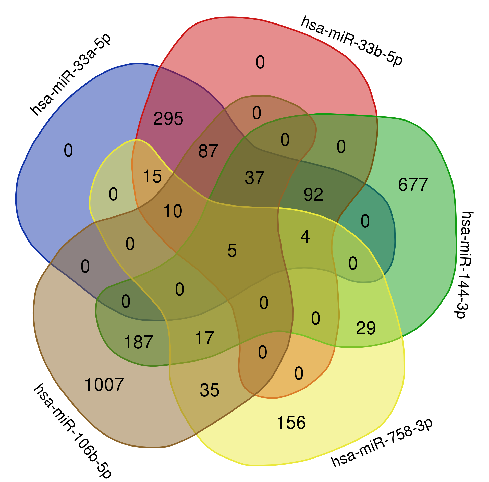

# Atherosclerosis miRNA Bioinformatics Analysis
Bioinformatics analysis of miRNA target genes, functional annotation, and pathway enrichment associated with cholesterol metabolism and atherosclerosis.


## Project Overview

This project investigates the predicted target genes of five human microRNAs associated with cholesterol metabolism and atherosclerosis.

The analysis integrates target prediction, identification of common target genes, functional annotation, and pathway enrichment analysis to explore the biological mechanisms potentially regulated by these miRNAs.

### Analyzed miRNAs

* hsa-miR-33a-5p
* hsa-miR-33b-5p
* hsa-miR-144-3p
* hsa-miR-758-3p
* hsa-miR-106b-5p

---

## Objectives

* Identify predicted target genes for each miRNA using TargetScan.
* Determine common target genes shared among all five miRNAs.
* Investigate the biological function of common targets using UniProt.
* Perform pathway enrichment analysis using GeneCodis.
* Interpret the results in the context of cholesterol metabolism and atherosclerosis.

---

## Workflow

```text
TargetScan
     ↓
Target Gene Identification
     ↓
Venn Diagram Analysis
     ↓
Common Target Genes
     ↓
UniProt Functional Annotation
     ↓
GO Biological Process
KEGG Pathways
Reactome
     ↓
Biological Interpretation
```

## Repository Structure

```text
atherosclerosis-mirna-bioinformatics-analysis
│
├── README.md
│
├── data/
│   ├── miR33a_targets.txt
│   ├── miR33b_targets.txt
│   ├── miR144_targets.txt
│   ├── miR758_targets.txt
│   └── miR106b_targets.txt
│
├── figures/
│   ├── venn_diagram.png
│   ├── go_biological_process.png
│   ├── kegg_pathways.png
│   └── reactome_pathways.png
│
├── report/
│   └── Activity1_miRNA_Target_Analysis.pdf
│
└── docs/
    └── references.md
```

---

## Common Target Genes

Five common target genes were identified:

| Gene    | Biological relevance |
| ------- | -------------------- |
| ABCA1   | High                 |
| KPNA3   | Limited              |
| SCN1A   | Low                  |
| TSC22D2 | Low                  |
| SNTB2   | Low                  |

ABCA1 was identified as the most biologically relevant target because of its central role in cholesterol efflux, HDL formation, and reverse cholesterol transport.

---

## Results

### Venn Diagram



### GO Biological Process

Insert image here

### KEGG Pathways

Insert image here

### Reactome Pathways

Insert image here

---

## Main Findings

* ABCA1 emerged as the most relevant common target gene.
* Enrichment analyses highlighted pathways related to cholesterol metabolism.
* HDL assembly and reverse cholesterol transport were strongly represented.
* Reduced expression of the analyzed miRNAs could increase ABCA1 expression and promote cholesterol efflux from macrophages.

---

## Tools and Databases

* TargetScan
* UniProt
* GeneCodis
* Venn Diagram Tool

---

## Skills Demonstrated

* Bioinformatics
* Functional Genomics
* miRNA Analysis
* Gene Annotation
* Pathway Enrichment Analysis
* Biological Data Interpretation
* Scientific Reporting

---

## Author

Caren Moreno

MSc in Bioinformatics

Universidad Internacional de La Rioja (UNIR)

---

## License

This project is distributed under the MIT License.
